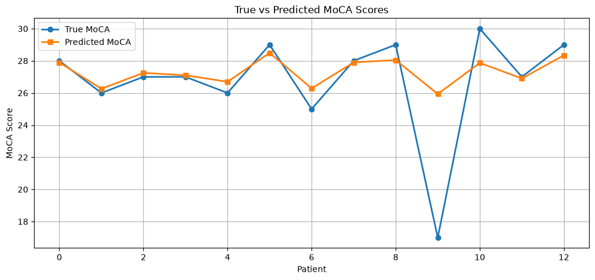
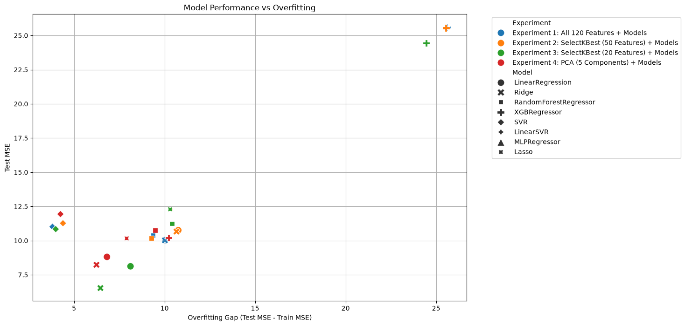

# MoCA Score Prediction Using Machine Learning

> **Project Status:** 🚧 Work in Progress

This repository is under active development. The preprocessing pipeline, model evaluation, and external prediction workflow are still being refined.

## 📌 Overview

This project aims to predict the Montreal Cognitive Assessment (MoCA) score using machine learning models trained on virtual reality (VR)-based medical assessment data collected from real patients.

Several preprocessing strategies, feature selection methods, and regression algorithms are evaluated using Leave-One-Out Cross-Validation (LOOCV) due to the limited number of labeled samples.

The project is divided into **4 main parts**, all contributing to a unified pipeline:

1. Cleaning Basic CSV 
2. Extracting Features of Each patient
3. Data preprocessing
4. Model Desgining (combine of three different solution)
    
    4.1solution one : Testing 7 Regression models with 8 Feautre selection methods with LeaveOneOut.
    
    4.2 solution two : Testing 7 Regression models with data augmentation methods with LeaveOneOut.
    
    4.3 solution three : Combining the best configuration of solution one with best of the solution two.

🎯 **Goal:**

* Predict the MoCA score

---

## 📂 Dataset

Data Source: Nine CSV files containing the behavioral data of each patient collected during the VR assessment.

Patients with Available MoCA Scores: 13

---

## Part 1: Cleaning Basic CSV


---

## Part 2: Extracting Features of Each patient

---

## Part 3: Data preprocessing

---

## Part 4: Model Desgining

### Models Used:
### Feature Selection Methods:

## 📊 Results (solution one):

Feel free to check the Results_figures folder to get more details about all models result
Best results of LOO + 13 real patients

| Model  | Feature selection | Test MSE |   Gap | Overfitting |
| ------ | ----------------: | -------: | ----: | ----------- |
| SVR    | All 120 Features  | 11.01    | 3.81  | Low         |
| SVR    | Select50Best      | 11.27    | 4.39  | Low         |
| SVR    | Select20Best      | 10.84    | 3.99  | Low         |
| SVR    | PCA               | 11.94    | 4.25  | Low         |



-------------------------------------------------------------------------------




### 📊 Results (solution two):

### 📊 Results (solution three):


**For detailed results and visualizations of all evaluated models, please refer to the Results_figures folder.**
---

## 🚀 How to Run the Project

```bash
# Clone the repository
git clone git@github.com:sana-mirahsani/detection_AD_with_VR_data.git

# Install dependencies
pip install -r requirements.txt

# Run notebooks / scripts
```

---

## 🛠️ Technologies Used

* 🐍 Python
* 📊 Pandas, NumPy
* 🤖 Scikit-learn
* 📈 Matplotlib

---

## 📌 Future Improvements

* Increase the number of patients with real MoCA score

---

## 👩‍💻 Authors

* Sana Mirahsani

🔗 LinkedIn: [https://www.linkedin.com/in/sana-mirahsani](https://www.linkedin.com/in/sana-mirahsani)
💻 GitHub: [https://github.com/sana-mirahsani](https://github.com/sana-mirahsani)

---

## ⭐ Support

If you find this project useful:

* ⭐ Star the repo
* 🍴 Fork it

---